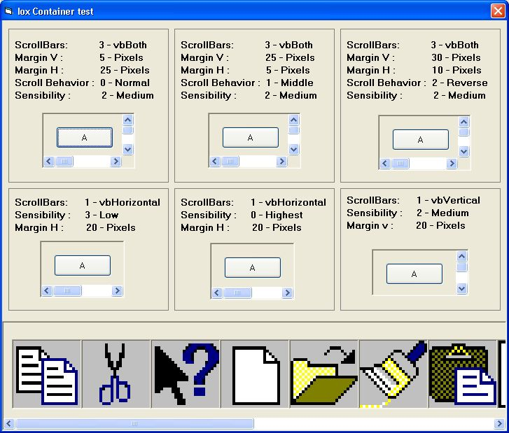

<div align="center">

## IOX Container


</div>

### Description

This is the most advanced container control in PSC, must see screenshot.

Did you love controls that don't have much "client-side" code...

Ok, this is a 0 line client-side code control, It&#180;s a REAL container,

You just put controls inside and the contros do the dirty job.

Allows to put many controls in the panel, an use scrollbars to acces them

This panel suport Mouse Wheel, WITHOUT SUBCLASS, just uses the free time

to Peek Messages, so its IDE safe.

It has a lot of features, like:

-Use ScrollBarConstants (vbBoth, vbVertical, vbSBNone, vbHorizontal)

-Use ScrollBar sensibility

-Vertical and horizontal margin to ajust the contained controls

-Change the potion of the scrolls when a contained controls got focus

-Is aligneable

I got the idea from IsPanel, By DavidJ, but this is a complete rewrite, so

it uses diferent and more eficient programing techniques.
 
### More Info
 
To use XP theming, jut compile to iox.exe to use the iox.exe.manifest.


<span>             |<span>
---                |---
**Submitted On**   |2005-07-05 12:39:22
**By**             |[Ivan Tellez](https://github.com/Planet-Source-Code/PSCIndex/blob/master/ByAuthor/ivan-tellez.md)
**Level**          |Advanced
**User Rating**    |5.0 (25 globes from 5 users)
**Compatibility**  |VB 6\.0
**Category**       |[Custom Controls/ Forms/  Menus](https://github.com/Planet-Source-Code/PSCIndex/blob/master/ByCategory/custom-controls-forms-menus__1-4.md)
**World**          |[Visual Basic](https://github.com/Planet-Source-Code/PSCIndex/blob/master/ByWorld/visual-basic.md)
**Archive File**   |[IOX\_Contai190937752005\.zip](https://github.com/Planet-Source-Code/ivan-tellez-iox-container__1-61529/archive/master.zip)

### API Declarations

```
Function GetSystemMetrics Lib "user32"
Function GetCursorPos Lib "user32"
Function GetWindowRect Lib "user32"
Function PeekMessage Lib "user32"
Function WaitMessage Lib "user32"
```


